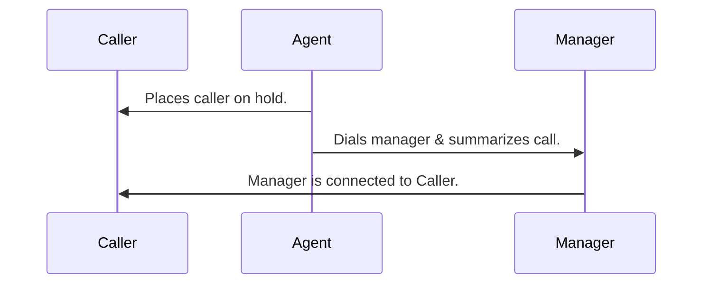
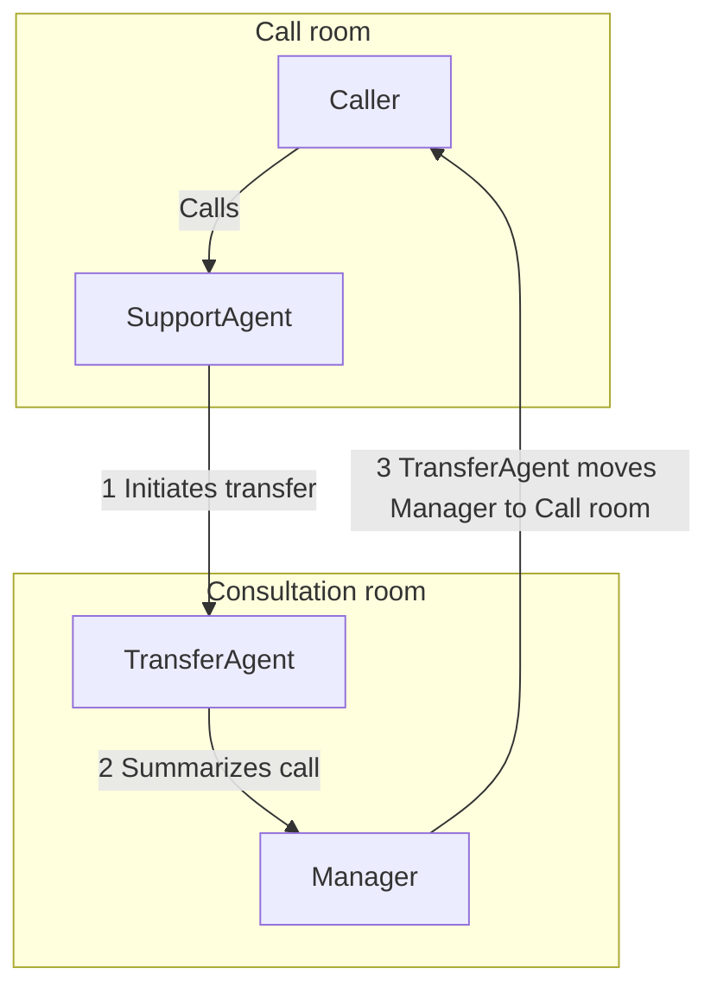

warning: the LiveKit docs server is version 1.5.0 but this CLI was built for 1.4.x — consider updating lk to the latest version
## /telephony/features/transfers/warm

LiveKit docs › Telephony › Features › Transfers › Agent-assisted transfer

---

# Agent-assisted warm transfer

> How to transfer a call from an AI agent to a human operator while providing a contextual summary.

## Overview

A _warm transfer_ involves transferring a caller to another number or SIP endpoint, with an agent assisting in the process. During the transfer, the agent can provide a summary, pass along collected information, or other context about the call to the person the call is being transferred to. If the transferee is unavailable, the agent can return to the original caller, explain the situation, and either attempt another transfer or end the call. In this topic, the transferee is referred to as the _manager_ for example purposes.

## How it works

The following high-level steps occur during a warm transfer:

1. Caller is placed on hold.
2. Manager is dialed into a private consultation room.
3. Agent provides the manager with context about the call.
4. Manager is connected to the caller. The agent can optionally introduce them.
5. Agent leaves, and the caller and manager continue the call.

This simplified process reflects how the caller experiences the transfer, as shown in the following sequence diagram:



While the caller experiences one agent, it's best to use a workflow to orchestrate the different stages of the transfer while maintaining a clean user experience. The following sections describe the required setup for warm transfer in detail.

## Telephony setup

In order for your agent to transfer calls to another number, you need outbound trunk configuration — either [inline](https://docs.livekit.io/telephony/making-calls/outbound-calls.md#inline-trunk) or via a stored [outbound trunk](https://docs.livekit.io/telephony/making-calls/outbound-trunk.md). If you also want to receive calls, you need an [inbound trunk](https://docs.livekit.io/telephony/accepting-calls/inbound-trunk.md) and a [dispatch rule](https://docs.livekit.io/telephony/accepting-calls/dispatch-rule.md). For SIP trunking provider instructions, see [SIP trunk setup](https://docs.livekit.io/telephony/start/sip-trunk-setup.md).

> 💡 **Testing warm transfer**
> 
> You can test warm transfer functionality using the [Agent Console](https://docs.livekit.io/agents/start/console.md). Speak to your agent and request a transfer. Outbound trunk configuration is _required_ to make the call to the manager. However, inbound call support can be added at any time.

## Warm transfer task

Available in (BETA):
- [ ] Node.js
- [x] Python

The warm transfer task is a prebuilt agent task that automatically orchestrates the warm transfer [workflow](#how-it-works). To execute a warm transfer, call the task with the manager's phone number and trunk configuration. You can pass [inline trunk configuration](https://docs.livekit.io/telephony/making-calls/outbound-calls.md#inline-trunk) using `sip_connection` or reference a stored trunk by ID with `sip_trunk_id`.

```python
import os

from livekit.agents.beta.workflows import WarmTransferTask
from livekit.protocol.sip import SIPOutboundConfig

result = await WarmTransferTask(
    sip_call_to=<manager-phone-number>,   # Manager's phone number
    sip_connection=SIPOutboundConfig(      # Inline trunk configuration
        hostname=os.getenv("SIP_TRUNK_HOSTNAME"),
        auth_username=os.getenv("SIP_AUTH_USERNAME"),
        auth_password=os.getenv("SIP_AUTH_PASSWORD"),
    ),
    chat_ctx=self.chat_ctx,               # Conversation history
    dtmf="wwww1234#",                     # Dial extension 1234 after ~2s pause
    ringing_timeout=30.0,                 # Give up after 30s if no answer
)

```

> ℹ️ **Stored outbound trunk**
> 
> You can also use a stored outbound trunk by passing `sip_trunk_id` instead of `sip_connection`. For details, see [WarmTransferTask](https://docs.livekit.io/agents/prebuilt/tasks/warm-transfer.md).

To learn more about additional parameters and customization, see [WarmTransferTask](https://docs.livekit.io/agents/prebuilt/tasks/warm-transfer.md).

### Example

For a full Python example, see the following.

- **[Warm Transfer](https://github.com/livekit/agents/tree/main/examples/warm-transfer)**: Transfer calls from an AI agent to a human operator with context.

## Manual warm transfer workflow

LiveKit recommends using the [warm transfer task](#task) for most use cases. If you need more control over the transfer process, the following sections can help you implement warm transfer manually.

### Agent setup

You need two agent sessions to complete a warm transfer. For warm transfer, each session is a private [room](https://docs.livekit.io/intro/basics/rooms-participants-tracks/rooms.md) for communicating individually with the caller and the manager, before connecting them. This is different from the more common multi-agent use case, where different agents are coordinated within a single session.

The first session is the caller's session. This agent speaks with the caller and initiates the transfer. In the rest of this topic, this agent is referred to as `SupportAgent`. This agent is responsible for identifying when the caller wants to be transferred and initiating the transfer process.

The second session is the manager's session. This session is configured for a specific purpose: Providing a summary to the manager and connecting them with the caller. In this topic, an agent named `TransferAgent` is used for this purpose.

### Session management

A custom session management class is required to track state across calls and participants, and for methods for managing the transfer workflow.

The following are some example states that identify what is happening in the call for each user participant:

- Caller: `active`, `escalated`, `inactive`
- Manager: `inactive`, `summarizing`, `merged`, `failed`

Session management methods can be used by both agents and can include the following examples:

- Placing the caller on hold.
- Playing hold music.
- Creating a consultation room for the transfer agent.
- Moving the manager into the caller's room.
- Returning to the caller if the manager is unavailable.

### Warm transfer workflow

The following diagram shows the detailed workflow for a warm transfer.



1. Initiating the transfer process requires multiple steps:

- Place caller on hold.
- Create the consultation room
- Create `TransferAgent`, passing the conversation history.
- Call the manager.
2. `TransferAgent` summarizes the call to the manager. You can customize what information the agent provides about the call and caller for your specific use case.
3. After the manager is informed, the `TransferAgent` moves the manager to the call room. At this point, the `SupportAgent` can provide an introduction between the caller and manager.
4. The `TransferAgent` leaves the consultation room and the `SupportAgent` leaves the call room, leaving the caller and manager to continue the call.

#### Step 1: Initiate transfer process

Initiating the transfer involves multiple sub-steps:

- Place caller on hold.
- Generate a token for the `TransferAgent` to join the consultation room.
- Create the consultation room.
- Connect the `TransferAgent` to the consultation room.
- Dial the manager.

##### Place caller on hold

The first step in the transfer process is to place the caller on hold. This means disabling audio input and output for the caller, and optionally playing hold music.

**Python**:

```python
# customer_session is the AgentSession for the initial call
customer_session.input.set_audio_enabled(False)
customer_session.output.set_audio_enabled(False)

```

---

**Node.js**:

```typescript
// customerSession is the AgentSession for the initial call
customerSession.input.setAudioEnabled(false);
customerSession.output.setAudioEnabled(false);

```

To play hold music in Python, see [Background audio](https://docs.livekit.io/agents/multimodality/audio/background-audio.md). In Node.js, see [Publishing local audio files](https://docs.livekit.io/transport/media/raw-tracks.md#publishing-local-audio-files).

##### Token generation

The `TransferAgent` needs a token to join the consultation room. Generate a token with the appropriate permissions:

**Python**:

```python
from livekit import api

# Name of the room where the agent consults with the transferee.
consult_room_name = "consult-room"
# Transfer agent identity
transfer_agent_identity = "transfer-agent"

# Assumes the api_key and api_secret are set in environment variables
access_token = (
    api.AccessToken()
    .with_identity(transfer_agent_identity)
    .with_grants(
        api.VideoGrants(
            room_join=True,
            room=consult_room_name,
            can_update_own_metadata=True,
            can_publish=True,
            can_subscribe=True,
        )
    )
)
token = access_token.to_jwt()

```

---

**Node.js**:

```typescript
import { AccessToken, VideoGrant } from 'livekit-server-sdk';

// Name of the room where the agent consults with the transferee.   
const consultRoomName = 'consult-room';
// Transfer agent identity
const transferAgentIdentity = 'transfer-agent';

// Assumes the api_key and api_secret are set in environment variables
const accessToken = new AccessToken('','',
  { identity: transferAgentIdentity, }
);

const videoGrant: VideoGrant = { 
  room: consultRoomName,
  roomJoin: true,
  canPublish: true,
  canSubscribe: true,
  canUpdateOwnMetadata: true,
};

accessToken.addGrant(videoGrant);

const token = await accessToken.toJwt();

```

To learn more about authentication tokens, see [Authentication](https://docs.livekit.io/frontends/authentication.md).

##### Create the consultation room

Use `rtc.Room` to create the consultation room:

**Python**:

```python
from livekit import rtc

consult_room = rtc.Room()

```

---

**Node.js**:

Install the `@livekit/rtc-node` package:

```shell
pnpm add @livekit/rtc-node

```

Then import the `Room` module and create a room:

```typescript
import { Room } from '@livekit/rtc-node';

const consultRoom = new Room();

```

##### Connect the `TransferAgent` to the consultation room

Use the token you generated to connect the `TransferAgent` to the consultation room:

**Python**:

```python
import os

consult_room.connect(os.environ["LIVEKIT_URL"], token)

```

---

**Node.js**:

```typescript
import dotenv from 'dotenv';

dotenv.config();

consultRoom.connect(process.env.LIVEKIT_URL, token);

```

##### Call the manager

After you create the consultation room and connect the `TransferAgent` to it, call the manager to add them to the room. Use the `CreateSIPParticipant` API to dial the manager. The `room_name` is the name of the consultation room you used when you created the authentication token, and the `participant_identity` is the identity of the manager.

**Python**:

`ctx.api` in the following example is the `LiveKitAPI` object in the job context. This example uses [inline trunk configuration](https://docs.livekit.io/telephony/making-calls/outbound-calls.md#inline-trunk). You can also use `sip_trunk_id` with a stored outbound trunk ID instead.

```python
import os

from livekit import api
from livekit.protocol.sip import SIPOutboundConfig

MANAGER_CONTACT = "<manager-contact-number>"

await ctx.api.sip.create_sip_participant(
    api.CreateSIPParticipantRequest(
        trunk=SIPOutboundConfig(
            hostname=os.getenv("SIP_TRUNK_HOSTNAME"),
            auth_username=os.getenv("SIP_AUTH_USERNAME"),
            auth_password=os.getenv("SIP_AUTH_PASSWORD"),
        ),
        sip_number="<SIP provider number>", # Required when using inline trunk config
        sip_call_to=MANAGER_CONTACT,
        room_name=consult_room_name,
        participant_identity="Manager",
        wait_until_answered=True,
    )
)

```

---

**Node.js**:

The following example assumes the LiveKit URL, API key, and secret are set as environment variables. This example uses [inline trunk configuration](https://docs.livekit.io/telephony/making-calls/outbound-calls.md#inline-trunk). You can also pass a stored outbound trunk ID as the first argument instead.

```typescript
import { LiveKitAPI } from 'livekit-server-sdk';
import { SIPOutboundConfig } from '@livekit/protocol';

const managerContact = "<manager-contact-number>";

const api = new LiveKitAPI();

await api.sip.createSipParticipant(
    '', // Empty string when using inline trunk config
    managerContact,
    consultRoomName,
    {
        participantIdentity: 'Manager',
        fromNumber: '<SIP provider number>', // Required when using inline trunk config
        waitUntilAnswered: true,
    },
    new SIPOutboundConfig({ // Inline trunk configuration
        hostname: process.env.SIP_TRUNK_HOSTNAME,
        authUsername: process.env.SIP_AUTH_USERNAME,
        authPassword: process.env.SIP_AUTH_PASSWORD,
    }),
);

```

#### Step 2: Summarize the call

In order to summarize the call, the `TransferAgent` needs to get the conversation history from the `SupportAgent`. To do this, pass the conversation history when you create `TransferAgent`:

**Python**:

```python
class TransferAgent(Agent):
    def __init__(self, prev_ctx: llm.ChatContext) -> None:
        prev_convo = ""
        context_copy = prev_ctx.copy(
            exclude_empty_message=True, exclude_instructions=True, exclude_function_call=True
        )
        for msg in context_copy.items:
            if msg.role == "user":
                prev_convo += f"Customer: {msg.text_content}\n"
            else:
                prev_convo += f"Assistant: {msg.text_content}\n"

        # Include the conversation history in the instructions
        super().__init__(
            instructions=(
                f"You are a manager who can summarize the call. "
                f"Here is the conversation history: {prev_convo}"
            ),
            # ...
        )    
    # ...

```

---

**Node.js**:

```typescript
class TransferAgent extends voice.Agent {
  constructor(prevCtx: llm.ChatContext) {
    const ctxCopy = prevCtx.copy(
      excludeEmptyMessage: true,
      excludeInstructions: true,
      excludeFunctionCall: true
    );
    const prevConvo = "";
    try { 
    for (const msg of ctxCopy.items) {
      if (msg.role === "user") {
        prevConvo += `Customer: ${msg.text_content}\n`;
      } else {
        prevConvo += `Assistant: ${msg.text_content}\n`;
      }
    }
    } catch (error) {
      console.error("Error copying chat context:", error);

    }
    super({
      instructions: `You are a manager who can summarize the call. Here is the conversation history: ${prevConvo}`,
      // ...
    });
  }
}

```

Create the `TransferAgent` with the conversation history:

**Python**:

```python
manager_agent = TransferAgent(prev_ctx=self.customer_session.chat_ctx)

```

---

**Node.js**:

```typescript
manager_agent = new TransferAgent(prevCtx=self.customer_session.chatCtx);

```

#### Step 3: Move the manager to the call room

After the `TransferAgent` summarizes the call, and the manager is ready to talk to the customer, use the `MoveParticipant` API to move the manager to the call room where the caller is on hold.

**Python**:

```python
from livekit import api

await ctx.api.room.move_participant(
  api.MoveParticipantRequest(
    room="<CONSULT_ROOM_NAME>",
    identity="<MANAGER_IDENTITY>",
    destination_room="<CUSTOMER_ROOM_NAME>",
  )
)

```

---

**Node.js**:

```typescript
import { LiveKitAPI } from 'livekit-server-sdk';

const api = new LiveKitAPI();

await api.room.moveParticipant(consultRoomName, managerIdentity, customerRoomName);

```

After the manager is in the call room, the `SupportAgent` can provide an introduction between the caller and manager before disconnecting from the room.

#### Step 4: Disconnect agents from rooms

You can disconnect the `TransferAgent` before you move the manager to the call room. The `SupportAgent` can leave when the manager is moved into the call room, or after providing an introduction.

To learn more, see [Ending the session](https://docs.livekit.io/agents/server/job.md#session-shutdown).

### Server API references

To learn more about the server APIs used for a manually executed warm transfer, see the following reference topics:

- [Token creation](https://docs.livekit.io/frontends/authentication/tokens.md#token-creation)
- [Create a room](https://docs.livekit.io/intro/basics/rooms-participants-tracks/rooms.md#create-a-room)
- [CreateSIPParticipant](https://docs.livekit.io/reference/telephony/sip-api.md#createsipparticipant)
- [MoveParticipant](https://docs.livekit.io/intro/basics/rooms-participants-tracks/participants.md#moveparticipant)

## Additional workflow scenarios

You can customize a call's workflow based on the consultation with the manager. For example, the manager might decide not to take the escalation and provide a reason for the denial. The agent can then inform the caller the reason for the denial. Alternatively, the manager might inform the agent the caller should be transferred to a different manager or department. The agent can pass that information back to the caller and start a new transfer process.

You can choose to use both warm and [cold transfer](https://docs.livekit.io/telephony/features/transfers/cold.md) depending on the context of the call. If a caller requests to be transferred directly to a specific person or department, the agent can inform the caller they are initiating the transfer, then transfer the caller directly using the SIP REFER method. In that case, the agent isn't involved after they initiate the transfer.

---

This document was rendered at 2026-08-24T21:31:37.735Z.
For the latest version of this document, see [https://docs.livekit.io/telephony/features/transfers/warm.md](https://docs.livekit.io/telephony/features/transfers/warm.md).

To explore all LiveKit documentation, see [llms.txt](https://docs.livekit.io/llms.txt).
